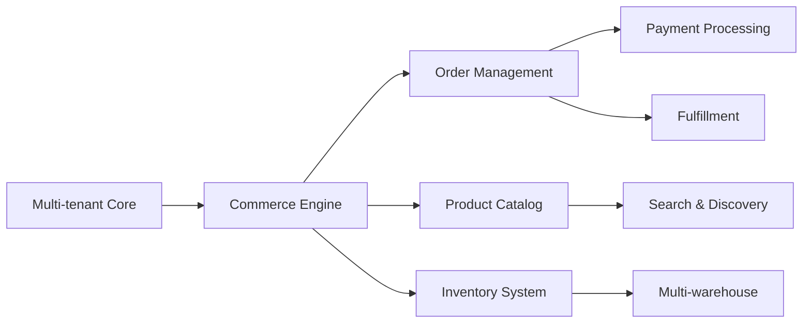
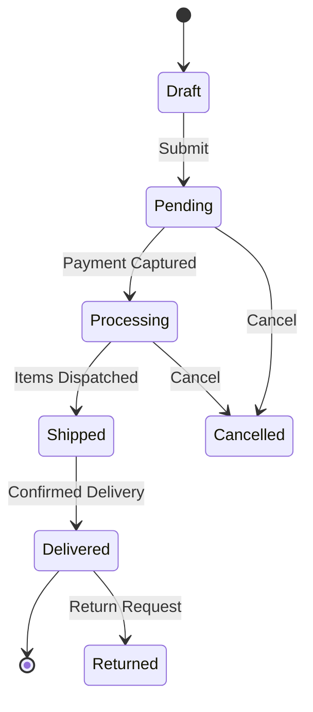

# 📋 ECOM Platform PRD v5.2 (Multilanguage Edition)
## Product Requirements Document — Enterprise E-commerce Platform


**Last Updated:** October 2025 • **Review Cycle:** Quarterly

---

## 📑 Table of Contents

1. [Executive Summary](#1-executive-summary)
2. [Business Requirements](#2-business-requirements)
3. [System Architecture](#3-system-architecture)
4. [Functional Specifications](#4-functional-specifications)
5. [Technical Requirements](#5-technical-requirements)
6. [Data Architecture](#6-data-architecture)
7. [Integration Requirements](#7-integration-requirements)
8. [Security & Compliance](#8-security--compliance)
9. [Performance & SLAs](#9-performance--slas)
10. [Implementation Roadmap](#10-implementation-roadmap)

**Appendices**
- [A. Ubiquitous Language](#appendix-a-ubiquitous-language)
- [B. Aggregates & Boundaries](#appendix-b-aggregates--boundaries)
- [C. Event Catalog](#appendix-c-event-catalog)
- [D. API Conventions](#appendix-d-api-conventions)
- [E. Testing & Quality Gates](#appendix-e-testing--quality-gates)
- [F. Observability SLOs](#appendix-f-observability-slos)
- [G. Data & Disaster Recovery](#appendix-g-data--disaster-recovery)
- [H. Governance & Compliance](#appendix-h-governance--compliance)
- [I. Architecture Decision Records](#appendix-i-architecture-decision-records)

---

## 1. Executive Summary

### 1.1 Vision Statement
Build a **scalable, maintainable, multi-tenant e-commerce platform** that enables businesses to sell products online with enterprise-grade features while maintaining complete data isolation and security.

### 1.2 Business Objectives
| Objective | Success Metric | Target |
|---|---|---|
| Market Position | Platform GMV | $100M by Year 2 |
| Scalability | Concurrent tenants | 1,000+ |
| Performance | Page load time | < 2 seconds |
| Reliability | Uptime SLA | 99.9% |
| Development Speed | Feature delivery | 2-week sprints |

### 1.3 Stakeholders
- **Business Owners**: multi-tenant capabilities, cost efficiency
- **Development Teams**: clean architecture, clear specifications
- **End Users**: fast, reliable shopping experience
- **System Integrators**: comprehensive APIs, documentation

### 1.4 Solution Overview


---

## 2. Business Requirements

### 2.1 Core Business Capabilities
#### Commerce Operations
| Capability | Description | Priority |
|---|---|---|
| Product Management | Simple, configurable, bundle, virtual, subscription | P0 |
| Order Processing | Full lifecycle from cart to delivery | P0 |
| Inventory Control | Real-time stock across warehouses | P0 |
| Pricing Engine | Dynamic pricing, segments, promotions | P1 |
| Tax Compliance | Multi-jurisdiction calculation, reports | P1 |
| Returns Management | RMA + inspection workflow | P2 |

#### Customer Experience
| Feature | User Story | Acceptance Criteria |
|---|---|---|
| Product Discovery | As a customer, I want to find products quickly | Search < 200ms; faceted filtering; auto-suggest |
| Configuration | As a customer, I want to customize products | Visual configurator; real-time pricing; validation rules |
| Checkout | As a customer, I want fast, secure checkout | Guest checkout; multiple payments; confirmation |
| Order Tracking | As a customer, I want to track my orders | Real-time status; shipment tracking; notifications |

### 2.2 Business Rules
```yaml
product_constraints:
  sku_format: "^[A-Z]{3}-[0-9]{6}$"
  min_price: 0.01
  max_variants: 1000
  max_bundle_items: 20

inventory_rules:
  reservation_timeout: 15_minutes
  low_stock_threshold: 10
  backorder_allowed: per_product

pricing_rules:
  discount_stacking: max_3
  promotion_priority: [cart_rule, catalog_rule, coupon]
  tax_calculation: destination_based
```

### 2.3 Multi-tenancy Requirements
| Requirement | Specification |
|---|---|
| Data Isolation | PostgreSQL RLS + Redis namespacing + ES index per tenant |
| Resource Quotas | Configurable per tier (SKUs, orders/min, storage) |
| Customization | Tenant themes, settings, workflows |
| Billing | Usage-based + tier upgrades (metered) |
| Provisioning | Self-service + automated bootstrap command |
| Disaster Recovery | Per-tenant backups; 30-day retention |

---

## 3. System Architecture

### 3.1 High-Level Architecture
```yaml
architecture:
  pattern: DDD
  style: Hexagonal (Ports & Adapters)
  communication: Event-Driven + CQRS
layers:
  presentation: Next.js 15 (UI only)
  application: Symfony 7.3 (Commands, Queries, Handlers, Sagas)
  domain: Aggregates, Entities, Value Objects, Domain Events
  infrastructure: PostgreSQL, Redis, RabbitMQ, Elasticsearch
governance:
  deptrac: enforced boundaries
  phpstan: level 8
  coding_standard: PSR-12
```

### 3.2 Bounded Contexts
| Context | Responsibility | Dependencies |
|---|---|---|
| Tenant | Provisioning, quotas, billing | - |
| Catalog | Products, SKUs, configurations | Tenant, Internationalization |
| Order | Cart, checkout, fulfillment | Catalog, Inventory, Pricing |
| Inventory | Stock, reservations, warehouses | Tenant |
| Pricing | Prices, promotions | Catalog |
| Customer | Profiles, segments, loyalty | Tenant, Internationalization |
| Payment | Processing, refunds | Order |
| Tax | Calculation, compliance | Order |
| Returns | RMA, inspections, refunds | Order, Inventory |
| Notifications | Email/SMS/Webhooks | All, Internationalization |
| **Internationalization** | Translations, locales, content localization | Tenant |

### 3.3 Technology Stack
| Component | Technology | Justification |
|---|---|---|
| Backend | Symfony 7.3 + PHP 8.3 | Mature, DDD-friendly |
| Frontend | Next.js 15 + TypeScript | SSR/SSG, DX |
| Database | PostgreSQL 16 | RLS, JSONB |
| Cache | Redis 7 | Performance |
| Queue | RabbitMQ 3.12 | Reliable messaging |
| Search | Elasticsearch 8 | Full-text & faceting |
| Money | brick/money | Precision & currency safety |
| IDs | ULID/UUID v7 | Orderable, unique |
| Time | UTC + ISO 8601 | Consistency |

---

## 4. Functional Specifications

### 4.1 Product Catalog
#### Product Types
| Type | Description | Configuration |
|---|---|---|
| Simple | Single SKU | Direct add to cart |
| Configurable | Variants (size, color) | Option selection |
| Bundle | Fixed/dynamic sets | Bundle builder |
| Virtual | Digital/downloadable | No shipping |
| Subscription | Recurring | Frequency selection |

#### SKU Generation
```yaml
sku_generation:
  pattern: "{CATEGORY}-{VENDOR}-{SEQUENCE}"
  example: "ELC-APL-000001"
  rules:
    - Unique per tenant
    - Auto-increment sequence
    - Collision detection
    - Reserved ranges per category
```

### 4.2 Order Management
#### Order Lifecycle


#### Checkout Process
| Step | Validations | Actions |
|---|---|---|
| Cart Review | Stock availability; price changes | Update totals |
| Shipping | Address validation; method eligibility | Calculate shipping |
| Payment | Method eligibility; 3DS if needed | Process payment |
| Confirmation | Final validation | Create order; send email |

### 4.3 Inventory Management
#### Stock Operations
| Operation | Trigger | Effect |
|---|---|---|
| Reserve | Add to cart | Soft reservation (15 min) |
| Allocate | Order confirmed | Hard allocation |
| Release | Order cancelled/expired | Return to available |
| Adjust | Manual/import | Update quantities |
| Transfer | Warehouse move | Location change |

#### Multi-warehouse Strategy
```yaml
warehouse_selection:
  priority: [shipping_zone, availability, priority_score, cost]
  splitting:
    enabled: true
    max_shipments: 3
    consolidation_delay: 24h
```

### 4.7 Internationalization & Multilanguage Support
#### Overview
**Business Objective**: Enable tenants to sell globally by providing content in multiple languages, supporting international markets expansion with minimal operational overhead.

**Architecture Principle**: All multilanguage logic resides in the **backend**. Frontend is a pure presentation layer consuming translated content via API.

#### Supported Languages (Initial Launch)
| Language | Locale Code | Market Priority | Coverage Target |
|---|---|---|---|
| English | `en_US`, `en_GB` | P0 - Default | 100% |
| Romanian | `ro_RO` | P0 - Primary | 100% |
| German | `de_DE` | P1 - EU Market | 100% |
| French | `fr_FR` | P1 - EU Market | 100% |
| Spanish | `es_ES` | P2 - Expansion | 80% |
| Italian | `it_IT` | P2 - Expansion | 80% |

#### Translation Scope
| Content Type | Translation Strategy | Fallback Behavior |
|---|---|---|
| UI Strings | Database-backed + cache | Fallback to en_US |
| Product Names | JSONB field per locale | Show default locale if missing |
| Product Descriptions | JSONB field per locale | Show default locale if missing |
| Category Names | JSONB field per locale | Show default locale if missing |
| CMS Content | Translatable entities | Show default locale content |
| System Messages | Translation service | Return key if missing |
| Email Templates | Locale-specific templates | en_US template |
| Error Messages | Translation service | Show error code |

#### Domain Model: Translation Aggregate
```yaml
translation_entity:
  id: TranslationId (UUID)
  tenant_id: TenantId (isolation)
  domain: string (messages, admin, shop, emails)
  key: string (dotted notation: "product.add_to_cart")
  locale: Locale (value object: language_country)
  value: string (translated content)
  parameters: array (interpolation params: {name}, {count})
  created_at: DateTimeImmutable
  updated_at: DateTimeImmutable

invariants:
  - Unique (tenant_id, domain, key, locale)
  - Value cannot be empty
  - Parameters must match placeholders in value
  - Locale must be valid ISO 639-1 + ISO 3166-1
```

#### Translatable Entities Strategy
**Product Entity (DDD Aggregate):**
```yaml
product:
  # Scalar fields (non-translatable)
  id: UUID
  tenant_id: UUID
  sku: string
  price: Money
  status: enum

  # Translatable fields (JSONB)
  name_translations: {
    "en_US": "Premium Wireless Headphones",
    "ro_RO": "Căști Premium Wireless",
    "de_DE": "Premium Kabellose Kopfhörer"
  }
  description_translations: {
    "en_US": "High-quality audio with 30h battery",
    "ro_RO": "Audio de înaltă calitate cu baterie 30h",
    "de_DE": "Hochwertige Audioqualität mit 30h Akkulaufzeit"
  }

  # Domain methods
  getName(Locale $locale): string
  getDescription(Locale $locale): string
  # Auto-fallback to default locale if translation missing
```

**Category Entity:**
```yaml
category:
  id: UUID
  tenant_id: UUID
  slug: string (URL-safe, locale-independent)

  name_translations: JSONB
  description_translations: JSONB

  # Methods
  getName(Locale $locale): string
  getDescription(Locale $locale): ?string
```

#### API Specification: Locale Handling
**Request Flow:**
```yaml
client_request:
  header: "Accept-Language: ro-RO, en-US;q=0.9"
  header: "X-Tenant-ID: tenant-uuid-here"

backend_processing:
  1. Extract locale from Accept-Language header
  2. Validate locale against tenant's enabled locales
  3. Set locale in request context
  4. Load translations for domain
  5. Resolve entity translations via domain methods

response:
  - All translatable fields returned in requested locale
  - Metadata includes: "X-Content-Language: ro_RO"
  - Fallback indicator if translation missing
```

**REST API Examples:**
```http
GET /api/products?locale=ro_RO
Accept-Language: ro-RO
X-Tenant-ID: tenant-123

Response:
{
  "data": [
    {
      "id": "prod-001",
      "sku": "HDN-001",
      "name": "Căști Premium Wireless",
      "description": "Audio de înaltă calitate cu baterie 30h",
      "price": { "amount": "199.99", "currency": "RON" },
      "_locale": "ro_RO",
      "_fallback": false
    }
  ],
  "meta": {
    "locale": "ro_RO",
    "available_locales": ["ro_RO", "en_US", "de_DE"]
  }
}
```

**GraphQL API:**
```graphql
type Product {
  id: ID!
  sku: String!
  name(locale: String): String!
  description(locale: String): String
  price: Money!
}

type Query {
  product(id: ID!, locale: String): Product
  products(filter: ProductFilter, locale: String): ProductConnection
}

# Client usage:
query GetProducts($locale: String!) {
  products(locale: $locale) {
    edges {
      node {
        id
        name(locale: $locale)
        description(locale: $locale)
      }
    }
  }
}
```

#### Translation Service Architecture
**Bounded Context:** `Internationalization`

**Application Layer:**
```yaml
commands:
  CreateTranslation:
    - tenant_id, domain, key, locale, value, parameters
    - Handler validates and persists

  UpdateTranslation:
    - tenant_id, domain, key, locale, new_value
    - Handler updates existing translation

  ImportTranslations:
    - tenant_id, domain, locale, translations_array
    - Bulk import with upsert logic

  DeleteTranslation:
    - tenant_id, domain, key, locale
    - Soft delete or hard delete per tenant policy

queries:
  GetTranslation:
    - Returns single translation with fallback

  GetTranslationsByDomain:
    - Returns all translations for domain+locale

  GetMissingTranslations:
    - Compares source locale vs target locale
    - Returns missing keys for translation

  GetTranslationCoverage:
    - Calculates % coverage per locale
```

**Domain Layer:**
```yaml
aggregates:
  Translation (root):
    - Methods: create, updateValue, delete, interpolate
    - Invariants enforced in domain

value_objects:
  Locale:
    - language: ISO 639-1 (2 chars)
    - country: ISO 3166-1 (2 chars)
    - Methods: toString(), getLanguage(), getCountry(), equals()

  TranslationId:
    - UUID wrapper for type safety

domain_events:
  - TranslationCreated
  - TranslationUpdated
  - TranslationDeleted
```

**Infrastructure Layer:**
```yaml
repositories:
  DoctrineTranslationRepository:
    - Implements TranslationRepositoryInterface
    - PostgreSQL with tenant isolation via RLS
    - Indexes: (tenant_id, domain, locale), (tenant_id, key, locale)

cache:
  strategy: Redis
  key_pattern: "i18n:{tenant_id}:{domain}:{locale}:{key_hash}"
  ttl: 3600 (1 hour)
  invalidation: on TranslationUpdated/Deleted events

  cache_warming:
    - Pre-load common translations on app boot
    - Domains: messages, validators, admin

api_endpoints:
  POST   /api/translations/create
  PUT    /api/translations/update
  DELETE /api/translations/delete
  POST   /api/translations/translate
  GET    /api/translations (list by domain+locale)
  POST   /api/translations/import
  GET    /api/translations/export
  GET    /api/translations/missing
  GET    /api/translations/stats
```

#### Locale Detection & Negotiation
```yaml
priority_order:
  1. Query parameter: ?locale=ro_RO
  2. HTTP header: Accept-Language
  3. User preference (if authenticated): user.preferred_locale
  4. Tenant default locale: tenant.default_locale
  5. System fallback: en_US

validation:
  - Locale must be in tenant's enabled_locales list
  - Invalid locale returns 400 Bad Request
  - Partial match: "ro" matches "ro_RO"
  - Quality values (q=) in Accept-Language respected
```

#### Frontend Integration (Presentation Only)
**Responsibilities:**
- Display translated content received from API
- Send `Accept-Language` header with user selection
- Provide UI for locale switcher (calls backend to persist preference)
- **NO** translation logic, dictionaries, or i18n libraries

**Example Implementation:**
```typescript
// Frontend only renders API response
const ProductCard = ({ product }) => (
  <div>
    <h3>{product.name}</h3>  {/* Already translated by backend */}
    <p>{product.description}</p>  {/* Already translated */}
  </div>
);

// Locale switcher updates API headers
const changeLocale = async (newLocale) => {
  setLocale(newLocale);
  // All subsequent API calls include: Accept-Language: newLocale
  await refetch(); // Data re-fetched with new locale
};
```

#### Performance Optimization
```yaml
caching:
  layer_1: Redis (translation strings, 1h TTL)
  layer_2: Application memory (Symfony Translator cache)
  layer_3: HTTP cache headers (Vary: Accept-Language)

database:
  indexes:
    - (tenant_id, domain, locale) - for bulk queries
    - (tenant_id, key, locale) - for single lookups
  partitioning:
    - Consider per-tenant schema if >100K translations

api_optimization:
  - Batch translation loading (single query per domain)
  - JSONB queries for entity translations (indexed)
  - GraphQL DataLoader for N+1 prevention

elasticsearch:
  - Index product translations separately
  - Language-specific analyzers (stemming, synonyms)
  - Boost relevance per locale
```

#### Translation Workflow (Content Management)
```yaml
roles:
  translator:
    - Can create/update translations
    - Limited to assigned locales
    - Cannot delete or export

  content_manager:
    - Full CRUD on translations
    - Can import/export
    - Manage translation coverage

  tenant_admin:
    - Configure enabled locales
    - Set default locale
    - Approve translations

workflow:
  1. Developer: Creates translation key in code
  2. System: Auto-detects missing translation (logs warning)
  3. Content Manager: Creates en_US translation (base)
  4. Translator: Translates to target locales
  5. QA: Reviews translations in staging
  6. System: Publishes to production
```

#### Business Rules
```yaml
constraints:
  max_locales_per_tenant: 10
  max_translations_per_tenant: 100_000
  translation_value_max_length: 5000
  translation_key_pattern: "^[a-z0-9_\\.]+$"

validation:
  - Parameter placeholders must match: "Hello {name}" requires {name}
  - HTML tags allowed only in specific domains (CMS content)
  - No script tags or dangerous content
  - Empty translations not allowed (use deletion instead)

fallback_strategy:
  1. Requested locale (ro_RO)
  2. Base language (ro)
  3. Tenant default locale
  4. en_US (system default)
  5. Translation key (last resort)
```

#### Observability & Monitoring
```yaml
metrics:
  - translation_cache_hit_rate (target: >90%)
  - translation_fallback_count (monitor missing translations)
  - translation_api_latency (target: <50ms)
  - locale_usage_distribution (optimize cache warming)

alerts:
  - Translation cache hit rate < 80%
  - Fallback rate > 10% for critical domains
  - Translation API p95 latency > 100ms
  - Missing translations for enabled locale

logs:
  - Translation not found: WARN level
  - Translation created/updated: INFO level
  - Bulk import: INFO with count
  - Cache invalidation: DEBUG level
```

#### Migration Strategy
```yaml
phase_1_preparation:
  - Create translations table and indexes
  - Implement Translation aggregate and service
  - Add API endpoints for translation management
  - Setup Redis cache with warming

phase_2_entity_translation:
  - Add JSONB columns to Product, Category, CMS entities
  - Create Doctrine event listener for auto-translation loading
  - Migrate existing content to en_US (default)
  - Update API responses to include translated fields

phase_3_ui_strings:
  - Extract hardcoded strings to translation keys
  - Import base translations (en_US)
  - Update frontend to use API-provided content
  - Deploy locale switcher UI

phase_4_additional_locales:
  - Professional translation of UI strings
  - Content translation for products/categories
  - Enable additional locales per tenant
  - Monitor and optimize performance
```

#### Testing Requirements
```yaml
unit_tests:
  - Translation aggregate invariants
  - Locale value object validation
  - Interpolation logic with parameters
  - Fallback chain logic

integration_tests:
  - Translation CRUD via API
  - Cache warming and invalidation
  - Entity translation loading from JSONB
  - Locale negotiation from headers

e2e_tests:
  - Locale switcher changes API responses
  - Product catalog displays in selected locale
  - Checkout flow in non-English locale
  - Email notifications in user's locale

performance_tests:
  - 1000 translations loaded in <100ms
  - Cache hit rate >90% under load
  - No N+1 queries on product listing
  - Locale switching doesn't degrade response time
```

#### Success Criteria
| Metric | Target | Measurement |
|---|---|---|
| Translation Coverage | >95% for P0 locales | Translation stats API |
| API Latency Impact | <10ms overhead | APM comparison |
| Cache Hit Rate | >90% | Redis metrics |
| Fallback Rate | <5% | Application logs |
| Locale Adoption | >30% non-EN traffic | Analytics |
| Content Localization | 100% critical paths | Manual audit |

---

## 5. Technical Requirements

### 5.1 API Specifications
#### REST
| Pattern | Method | Purpose |
|---|---|---|
| /api/products | GET | List with filters |
| /api/products/{{id}} | GET | Details |
| /api/cart | POST/PATCH | Manage cart |
| /api/orders | POST | Create order |
| /api/orders/{{id}} | GET | Order status |

#### GraphQL (excerpt)
```graphql
type Query {{
  product(id: ID!): Product
  products(filter: ProductFilter): ProductConnection
  cart: Cart
  order(id: ID!): Order
}}
type Mutation {{
  addToCart(input: AddToCartInput!): Cart
  checkout(input: CheckoutInput!): Order
}}
type Subscription {{
  orderStatusChanged(orderId: ID!): Order
  inventoryUpdated(productId: ID!): Inventory
}}
```

### 5.2 Messaging & Events
#### Domain Events (excerpt)
| Event | Payload | Subscribers |
|---|---|---|
| ProductCreated | Product data | Search indexer; Cache warmer |
| OrderPlaced | Order details | Inventory; Payment; Email |
| StockDepleted | Product ID; warehouse | Notifications; Purchasing |
| PaymentCaptured | Transaction data | Order; Accounting |

#### Message Flow
```yaml
event_bus:
  transport: RabbitMQ
  routing:
    product.*: catalog_queue
    order.*: order_queue
    inventory.*: inventory_queue
  reliability:
    retry: 3
    dead_letter: enabled
    ttl: 24h
idempotency:
  key: "Idempotency-Key" header
  window: 24h
```

### 5.3 Non-Functional Requirements
- **Versioning**: Semantic API v1; deprecations with 2-cycle grace
- **Pagination**: Cursor-based default; limit max=100
- **Sorting/Filtering**: Whitelisted fields; stable sort
- **Idempotency**: Required on POST /orders, /payments
- **Rate Limiting**: 100 RPM / tenant / endpoint (configurable)
- **Feature Flags**: Per-tenant rollout with kill switch

---

## 6. Data Architecture

### 6.1 Core Data Model
#### Product (simplified)
```sql
CREATE TABLE products (
    id UUID PRIMARY KEY,
    tenant_id UUID NOT NULL,
    sku VARCHAR(50) UNIQUE NOT NULL,
    type VARCHAR(20) NOT NULL,
    name VARCHAR(255) NOT NULL,
    data JSONB NOT NULL,
    created_at TIMESTAMPTZ NOT NULL,
    updated_at TIMESTAMPTZ NOT NULL
);
ALTER TABLE products ENABLE ROW LEVEL SECURITY;
CREATE POLICY tenant_isolation ON products
  FOR ALL USING (tenant_id = current_setting('app.tenant_id')::uuid);
```

### 6.2 Data Retention
| Data Type | Retention | Strategy |
|---|---|---|
| Orders | 7 years | Cold storage after 1 year |
| Customers | Until deletion request | Anonymize inactive |
| Logs | 90 days | Compress & archive |
| Analytics | 2 years | Aggregate & purge |

### 6.3 Backup & DR
- Nightly snapshots; PITR for DB
- Per-tenant restore supported
- RPO: 15 min • RTO: 2 h

---

## 7. Integration Requirements

### 7.1 Payment
| Gateway | Integration | Features |
|---|---|---|
| Stripe | API + Webhooks | Cards, wallets, subscriptions |
| PayPal | Express | PayPal, Venmo |
| Custom | Plugin interface | Extensible |

### 7.2 Shipping
| Provider | Integration | Features |
|---|---|---|
| UPS | REST | Rates, labels, tracking |
| FedEx | SOAP/REST | Rates, labels, tracking |
| DHL | REST | International |

### 7.3 ERP/CRM
```yaml
integration_patterns:
  sync:
    - Orders → ERP (real-time)
    - Inventory ← ERP (hourly batch)
    - Customers ↔ CRM (bi-directional)
  authentication:
    preferred: OAuth2
    fallback: API keys with rotation
  webhooks:
    delivery: retry with backoff; signature required
```

---

## 8. Security & Compliance

### 8.1 Security Requirements
| Layer | Requirement | Implementation |
|---|---|---|
| Authentication | MFA | JWT + TOTP |
| Authorization | RBAC + ABAC | Policies + Voters |
| Data Encryption | At rest + in transit | AES-256, TLS 1.3 |
| API Security | Rate limit, CORS | 100 req/min, allowlist |
| Audit Trail | All changes | Event sourcing + logs |

### 8.2 Compliance
| Standard | Requirements | Status |
|---|---|---|
| PCI DSS | Tokenized payments | Compliant |
| GDPR | Erasure, portability | Supported |
| CCPA | Opt-out, disclosure | Supported |
| WCAG 2.1 | Accessibility | AA target |

---

## 9. Performance & SLAs

### 9.1 Performance Targets
| Metric | Target | Measurement |
|---|---|---|
| Page Load | < 2s (p95) | RUM |
| API Response | < 200ms (p95) | APM |
| Search | < 100ms | ES metrics |
| Checkout | < 30s | E2E timing |
| Concurrent Users | 10,000/tenant | Load tests |

### 9.2 SLAs
| Service | Availability | Response Time | Support |
|---|---|---|---|
| Production | 99.9% | < 1s | 24/7 |
| API | 99.95% | < 200ms | 24/7 |
| Search | 99.9% | < 100ms | Business hours |
| Batch Jobs | 99% | N/A | Best effort |

### 9.3 Scalability
```yaml
scaling:
  horizontal:
    app: autoscale 2-20
    db: read replicas + pooling
    cache: redis cluster
  vertical:
    start: 4 vCPU / 16GB
    max: 32 vCPU / 128GB
  data:
    products_per_tenant: 1_000_000
    orders_per_year: 10_000_000
    active_customers: 500_000
```

---

## 10. Implementation Roadmap

### 10.1 Phases
| Phase | Timeline | Deliverables | Success Criteria |
|---|---|---|---|
| Foundation | Q1 2025 | Core platform, multi-tenancy | Infrastructure ready |
| Core Commerce | Q2 2025 | Products, orders, inventory | MVP features complete |
| Advanced Features | Q3 2025 | Promotions, returns, loyalty | Full feature set |
| Optimizations | Q4 2025 | Performance, ML agents | Production ready |

### 10.2 Sprint Structure
```yaml
sprint:
  duration: 2 weeks
  ceremonies: [planning, daily, review, retrospective]
  deliverables:
    user_stories: 5-8
    story_points: 20-30
    coverage: ">80%"
    docs: updated per PR
quality_gates:
  deptrac: required
  phpstan: level >= 8
  tests_pass: true
```

### 10.3 Release Strategy
| Type | Frequency | Process |
|---|---|---|
| Hotfix | As needed | Direct to prod |
| Patch | Weekly | Staged rollout |
| Minor | Bi-weekly | Feature toggles |
| Major | Quarterly | Blue/Green |

---

## Appendix A: Ubiquitous Language
- **Tenant**: isolated customer context
- **SKU**: stock keeping unit, unique per tenant
- **Reservation**: temporary stock hold prior to allocation
- **Allocation**: committed stock for paid orders
- **Backorder**: purchase allowed without available stock
- **RMA**: return merchandise authorization
- **Promotion**: rule-based discount applied to cart/catalog
- **Segment**: customer grouping for targeting
- **Price List**: scoped price rules per tenant/segment/region
- **Fulfillment**: pick/pack/ship workflow
- **Locale**: language + country combination (ISO 639-1 + ISO 3166-1)
- **Translation**: localized content mapped to a key, domain, and locale
- **Translation Domain**: logical grouping of translations (messages, admin, shop, emails)
- **Translation Key**: unique identifier for translatable content (dotted notation)
- **Fallback Locale**: default locale used when translation is missing
- **Content Localization**: process of adapting entity data (products, categories) to specific locales
- **Interpolation**: replacing placeholders in translations with dynamic values

---

## Appendix B: Aggregates & Boundaries
| Context | Aggregate Root | Invariants (examples) |
|---|---|---|
| Catalog | Product | SKU unique per tenant; active variants ≤ 1000; translations in JSONB |
| Order | Order | Total ≥ 0; status transitions via state machine |
| Inventory | StockItem | on_hand ≥ 0; reserved ≤ on_hand |
| Pricing | PriceList | non-overlapping rules per scope |
| Customer | Customer | unique email per tenant; preferred_locale valid |
| Returns | ReturnRequest | only from Delivered; refund ≤ paid |
| **Internationalization** | **Translation** | unique (tenant_id, domain, key, locale); value non-empty; parameters match placeholders |

---

## Appendix C: Event Catalog (excerpt)
| Event | Producer | Consumers | Notes |
|---|---|---|---|
| product.created | Catalog | Search, Cache | triggers ES indexing |
| product.price_changed | Pricing | Catalog, Promotions | re-price variants |
| order.placed | Order | Inventory, Payment, Email | idempotent |
| inventory.reserved | Inventory | Order | soft-hold |
| payment.captured | Payment | Order, Accounting | finalize order |
| order.shipped | Order | Notifications | tracking update |
| **translation.created** | **Internationalization** | **Cache** | invalidate translation cache |
| **translation.updated** | **Internationalization** | **Cache** | invalidate translation cache |
| **translation.deleted** | **Internationalization** | **Cache** | invalidate translation cache |

---

## Appendix D: API Conventions
- **Auth**: Bearer JWT; tenant via header `X-Tenant-ID`
- **Versioning**: `/api/v1/...`
- **Idempotency**: header `Idempotency-Key` on POST
- **Errors**: RFC 7807 problem+json with error codes
- **Pagination**: cursor params `after`, `limit`
- **Sorting**: `sort=field,(asc|desc)`
- **Filtering**: `filter[field]=value`
- **Money**: decimal string + ISO currency (handled by brick/money)
- **Dates**: ISO 8601 (UTC)
- **Locales**: header `Accept-Language` or query param `?locale=ro_RO`; response header `X-Content-Language`
- **Translation Metadata**: `_locale` and `_fallback` fields in responses when applicable

---

## Appendix E: Testing & Quality Gates
- **Test Pyramid**: domain > application > infrastructure > E2E
- **Coverage Target**: ≥ 80% (critical paths ≥ 90%)
- **Contract Tests**: for Ports/Adapters
- **Mutation Testing**: critical aggregates
- **Static Analysis**: PHPStan lvl 8; Deptrac rules enforced
- **Security Tests**: OWASP top 10 checks in CI

---

## Appendix F: Observability SLOs
| Signal | SLI | SLO |
|---|---|---|
| API Latency | p95 response time | < 200ms |
| Error Rate | 5xx per minute | < 0.5% |
| Availability | monthly uptime | ≥ 99.9% |
| Event Lag | max processing delay | < 5s |
| Search Index Freshness | sync delay | < 60s |

---

## Appendix G: Data & Disaster Recovery
- **Backups**: nightly + PITR; encrypted at rest
- **Per-tenant Restore**: supported via tenant-ID snapshot tags
- **RPO/RTO**: RPO 15 min • RTO 2 h
- **Retention**: Orders 7y; Logs 90d; Analytics 2y
- **GDPR**: export & deletion workflows documented

---

## Appendix H: Governance & Compliance
- **Coding Standards**: PSR-12
- **Static Analysis**: PHPStan ≥ lvl 8
- **Architecture**: Deptrac required in CI (fail on violations)
- **Coverage**: ≥ 80% global, ≥ 90% critical paths
- **Security**: JWT rotation policy; secrets in Vault
- **Accessibility**: WCAG 2.1 AA target
- **Audit**: immutable event store + append-only logs

---

## Appendix I: Architecture Decision Records (ADR)
| ID | Date | Decision | Context | Consequences |
|----|------|----------|---------|--------------|
| ADR-001 | 2025-01 | Symfony 7.3 backend | Mature DDD support | ✅ Ecosystem; ⚠️ PHP expertise |
| ADR-002 | 2025-01 | PostgreSQL + RLS | Native multi-tenancy | ✅ Isolation; ⚠️ PG16+ |
| ADR-003 | 2025-01 | Event-driven + CQRS | Scalability, decoupling | ✅ Independent scaling; ⚠️ eventual consistency |
| ADR-004 | 2025-01 | Bounded Contexts | Multiple teams, clarity | ✅ Clear ownership; ⚠️ coordination |
| ADR-005 | 2025-01 | ML agents | Accelerate delivery | ✅ Faster; ⚠️ human review |
| ADR-006 | 2025-01 | Deptrac | Enforce boundaries | ✅ Guardrails; ⚠️ CI dependency |
| ADR-007 | 2025-01 | JWT + RBAC/ABAC | Security | ✅ Flexible; ⚠️ token lifecycle |
| ADR-008 | 2025-01 | Next.js presentation-only | Separation of concerns | ✅ Clean FE; ⚠️ no business logic |
| **ADR-009** | **2025-01** | **Backend-only multilanguage** | Global expansion needs | ✅ Single source of truth; ✅ No FE i18n complexity; ⚠️ API overhead |
| **ADR-010** | **2025-01** | **JSONB for entity translations** | Performance + flexibility | ✅ No schema changes per locale; ✅ Fast queries; ⚠️ No relational constraints |

---

**Document Control**
- **Version**: 5.2 (Multilanguage Support Added)
- **Previous Version**: 5.1
- **Review Schedule**: Quarterly
- **Next Review**: April 2025
- **Approval**: Product Owner, Tech Lead, Architecture Board
- **Last Modified**: October 2025 (Added Section 4.7: Internationalization & Multilanguage Support)

**Change Log**:
- **v5.2 (Oct 2025)**: Added comprehensive multilanguage/i18n specification (Section 4.7)
- **v5.1 (Sep 2025)**: Initial production blueprint

**Contact**: product@ecom-platform.com

*This document is the single source of truth for ECOM Platform requirements.*
